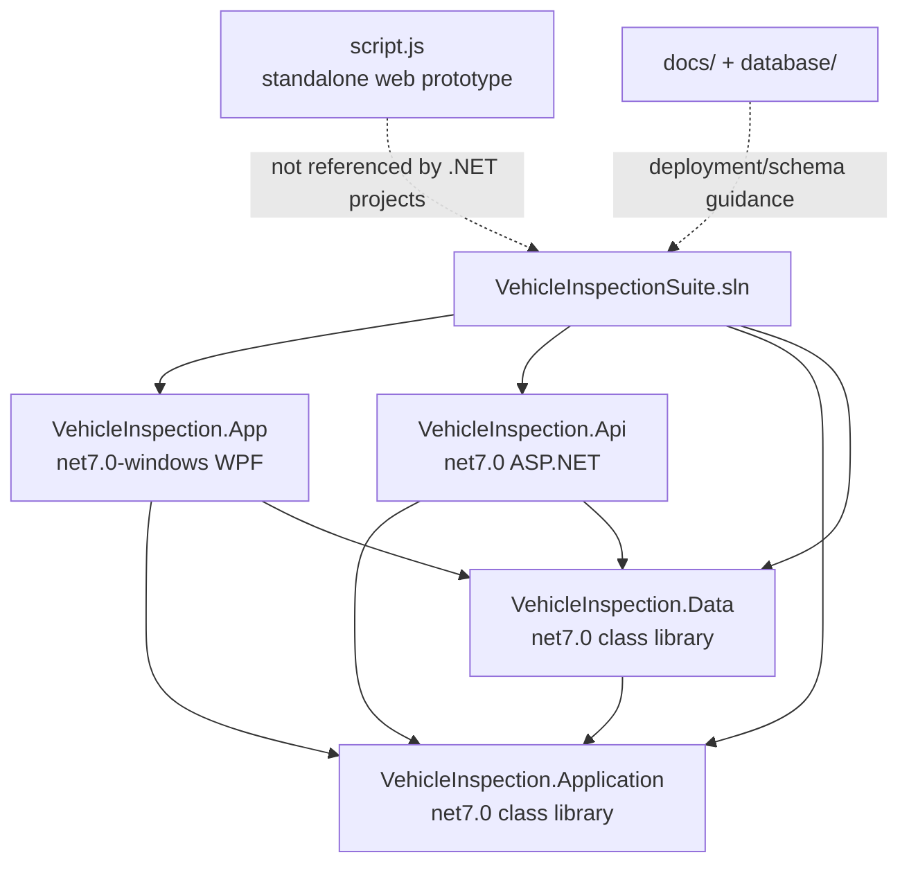
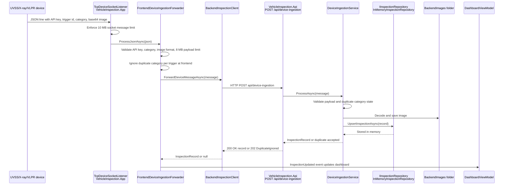
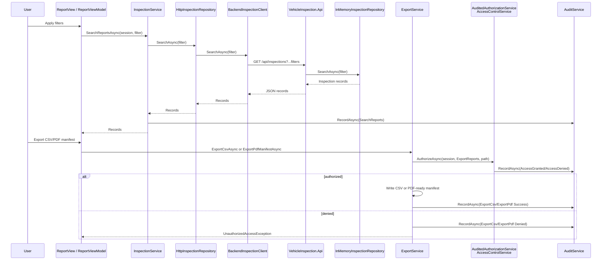

# Vehicle Inspection Software Graph

Generated for the current codebase. This document shows the major runtime flows and project dependencies for the UVSS Vehicle Inspection Suite.

## System architecture

```mermaid
flowchart LR
    subgraph Devices["External inspection devices"]
        UVSS["UVSS scanner"]
        XRAY["X-ray device"]
        VLPR["VLPR / plate camera"]
    end

    subgraph App["VehicleInspection.App (WPF frontend)"]
        MainWindow["MainWindow.xaml / MainWindow.xaml.cs"]
        MainVM["MainViewModel"]
        DashboardVM["DashboardViewModel"]
        ReportVM["ReportViewModel"]
        DashboardView["DashboardView.xaml"]
        ReportView["ReportView.xaml"]
        ZoomPan["ZoomPanImageControl"]
        Resources["Theme + EN/ZH resources"]
        Socket["TcpDeviceSocketListener<br/>127.0.0.1:47011"]
        Forwarder["FrontendDeviceIngestionForwarder"]
        BackendClient["BackendInspectionClient"]
        HttpRepo["HttpInspectionRepository<br/>IInspectionRepository adapter"]
    end

    subgraph Api["VehicleInspection.Api (ASP.NET backend)"]
        MinimalApi["Program.cs minimal API"]
        PostIngestion["POST /api/device-ingestion"]
        GetCurrent["GET /api/inspections/current"]
        GetReports["GET /api/inspections"]
        GetImages["GET /api/images/{triggerId}/{fileName}"]
    end

    subgraph Application["VehicleInspection.Application"]
        Models["Domain models<br/>InspectionRecord, DeviceIngestionMessage, ReportFilter, AuditEntry, UserSession"]
        InspectionSvc["InspectionService"]
        IngestionSvc["DeviceIngestionService"]
        AuditSvc["AuditService"]
        ExportSvc["ExportService"]
        SessionLock["SessionLockService"]
        Auth["WindowsAuthenticationService"]
        RBAC["AccessControlService + AuditedAuthorizationService"]
        RepoInterface["IInspectionRepository"]
    end

    subgraph Data["VehicleInspection.Data"]
        InMemoryRepo["InMemoryInspectionRepository\nseed inspections + audit entries"]
    end

    subgraph Storage["Local / deployment storage"]
        BackendImages["%LOCALAPPDATA%/UVSS/VehicleInspection/BackendImages"]
        DatabaseScripts["database/*.sql<br/>MSSQL schema + hardening + seed scripts"]
    end

    subgraph Prototype["Standalone web prototype"]
        WebProto["index.html / styles.css / script.js<br/>not used by WPF runtime"]
    end

    UVSS -->|newline-delimited JSON + base64 image| Socket
    XRAY -->|newline-delimited JSON + base64 image| Socket
    VLPR -->|newline-delimited JSON + base64 image| Socket

    MainWindow --> MainVM
    MainWindow --> DashboardView
    MainWindow --> ReportView
    MainWindow --> Resources
    DashboardView --> DashboardVM
    DashboardView --> ZoomPan
    ReportView --> ReportVM
    ReportView --> ZoomPan

    MainVM --> Auth
    MainVM --> SessionLock
    MainVM --> DashboardVM
    MainVM --> ReportVM
    MainVM --> Socket
    Socket --> Forwarder
    Forwarder -->|validates key/category/format/size; frontend duplicate guard| BackendClient
    Forwarder -->|InspectionUpdated event| DashboardVM

    MainVM --> BackendClient
    MainVM --> HttpRepo
    HttpRepo --> BackendClient
    DashboardVM --> InspectionSvc
    ReportVM --> InspectionSvc
    ReportVM --> ExportSvc
    InspectionSvc --> RepoInterface
    InspectionSvc --> AuditSvc
    AuditSvc --> RepoInterface
    ExportSvc --> RBAC
    ExportSvc --> AuditSvc
    RBAC --> AuditSvc
    Auth --> Models
    SessionLock --> Models

    BackendClient -->|HTTP| PostIngestion
    BackendClient -->|HTTP| GetCurrent
    BackendClient -->|HTTP| GetReports

    MinimalApi --> PostIngestion
    MinimalApi --> GetCurrent
    MinimalApi --> GetReports
    MinimalApi --> GetImages
    PostIngestion --> IngestionSvc
    GetCurrent --> RepoInterface
    GetReports --> RepoInterface
    GetImages --> BackendImages
    IngestionSvc --> Models
    IngestionSvc --> RepoInterface
    IngestionSvc -->|saves decoded images| BackendImages
    IngestionSvc -->|returns public image URLs| GetImages

    RepoInterface --> InMemoryRepo
    InMemoryRepo --> Models
    DatabaseScripts -. production target .-> RepoInterface
```

## Project reference graph

## Device ingestion sequence

## Report and export sequence

## Notes

- Devices communicate only with the WPF frontend socket listener; the frontend validates and forwards device messages to the backend HTTP API.
- The WPF app uses `HttpInspectionRepository` as an `IInspectionRepository` adapter over `BackendInspectionClient` for inspection reads/searches while keeping local in-memory audit entries for frontend audit actions.
- The backend registers `InMemoryInspectionRepository` for current inspections, searches, device upserts, and backend audit storage.
- `DeviceIngestionService` persists decoded image payloads under `%LOCALAPPDATA%/UVSS/VehicleInspection/BackendImages` and exposes them via `/api/images/{triggerId}/{fileName}`.
- `database/*.sql` documents the intended MSSQL production schema and hardening path, but the current runtime uses the in-memory repository.
- `script.js` belongs to an earlier static web prototype and is not referenced by the .NET WPF/API projects.
